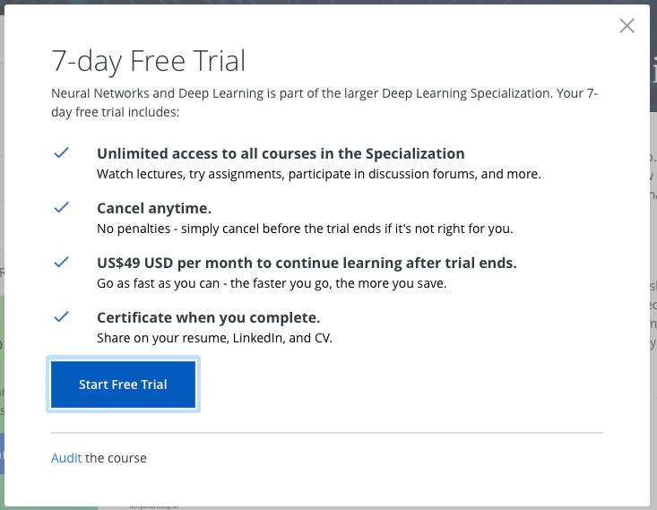

最近會開始推薦身邊的人上Coursera上面的課，不過常常遇到的第一個問題是：「得要繳錢才能上課嗎？我以為Coursera是免費的？」。雖然不確定日後Coursera的政策會怎麼變動，不過還是以現況的經驗寫點分享～

要回答這個問題，就得稍微說一下Coursera裡課程的設計結構和收費方式（以下文字全都只是通則，也是會有例外的）。Coursera上面的課（Course）大部分都被包在專項學程（Specialization）裡，後者包含同一個大學開設的數門系列課程。我們可以選擇一開始就註冊一整個學程，或是只挑其中有興趣的課程註冊，取決於在學程的頁面還是在個別課程的頁面按下註冊（enroll）鍵。收費方面，Coursera有轉變成訂閱制（subscription）的傾向，也就是註冊期間的每個月都要收費。

除了最近剛開始的幾個碩士學位學程之外，課程幾乎都是免費的，但是只限於旁聽（audit），目前為止我接觸過的課都有旁聽的選項，只是被藏在點選註冊之後的頁面裡很小的一個角落。要注意的是，如果一開始就選擇註冊一整個學程，那很可能看不到這個選項。

所謂旁聽，就是能夠無限制的看課程影片及其它閱讀材料，但是不能繳交作業，結束後也不能拿到證書。由於Coursera上證書的發放取決於作業成績是否全部及格，一旦達標，系統便會自動發送證書（其實首次拿證書的人還需要提早做身份驗證，但這裡就不講了），所以，「只想交作業但不需要證書」技術上不可行，它們綁在一起，因此的確有人詬病「連做習題都要錢」。不過，對於純粹只是想增進知識的人來說，的確是個免費的管道。

那麼，想做習題的人怎麼辦呢？以下有三個方法：

1. 利用「七天免費試上期」或「十四天退款期」（注意兩者不能並存，有七天免費試上期的課在第八天收費後是不能退款的）：現在大部分的課都有七天的免費試上期（上圖的Start Free Trial），而且可以在任何時候開始。也就是說，可以先旁聽，等到真的確定有興趣、也已準備好（通常是教材都已經看完），再決定升級訂閱，那時候才會開始算七天。在這七天內，如果完成所有作業並拿到證書，就可以取消訂閱了，一毛錢也不用花，證書不會被追回去。這也是個逼自己短時間內完成課程的方法。
2. 申請助學金（Financial Aid）：某些課程（或學程）對無法負擔訂閱費用的使用者有助學金制度，必須由使用者提出申請，Coursera會對每個申請案進行審核，審核通過就是免費。通常會希望接受助學金的使用者在課程結束後對學習社群做點回饋或幫助。
3. 成為Coursera的先行測試者（Beta Tester）：先行測試者要幫忙為即將對所有人公開的課程進行內部公測，不過並不是強制性的，可以選自己有興趣、有能力的課程測試即可。一旦在公測時期註冊課程，自然就能夠做該堂課的習題，並在結束後拿到課程證書。

最後，最簡單的方式當然就是花錢了事啦！有時候實在太忙，以上計畫都不可行，那就當繳學分費囉！ XD

一起來學習吧～